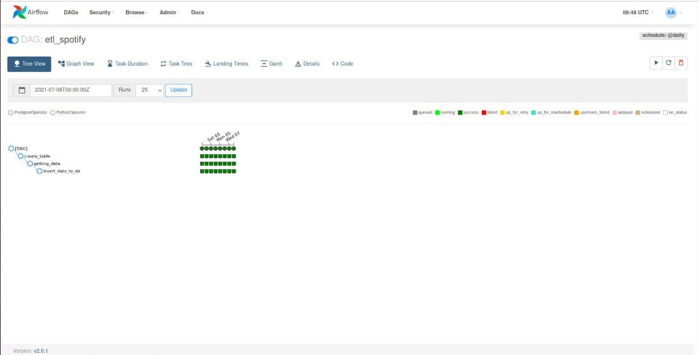
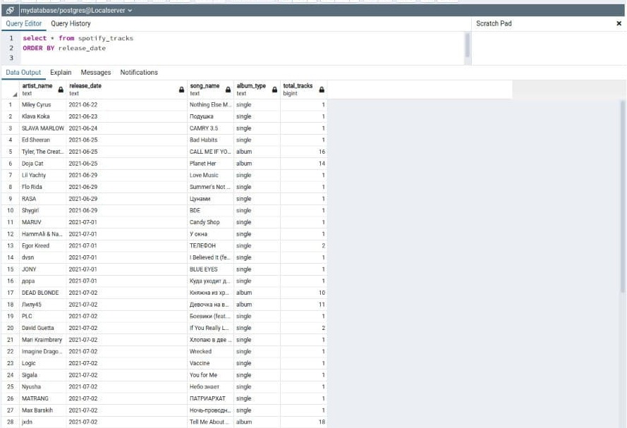

The project was created for educational purposes and to train my data skills. I wanted to build a simple data pipeline. Using the Spotify API, I downloaded new releases of songs and recorded them in a database. I managed the workflow through **Apache Airflow** using PythonOperator, PostgresOperator.
The project used the following libraries: **pandas**, **sqlalchemy**, **requests**

Airflow TreeView 
​

The uploaded data in the database
​
